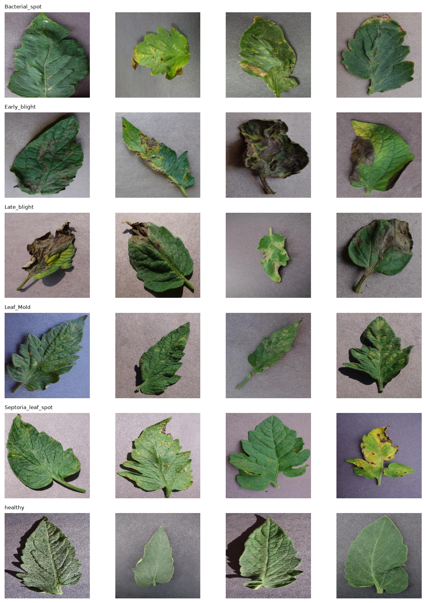
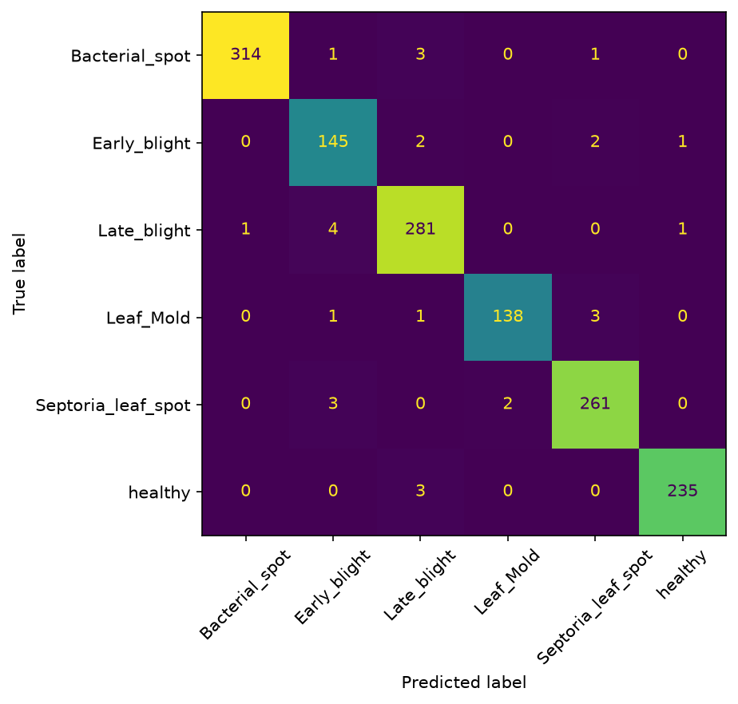
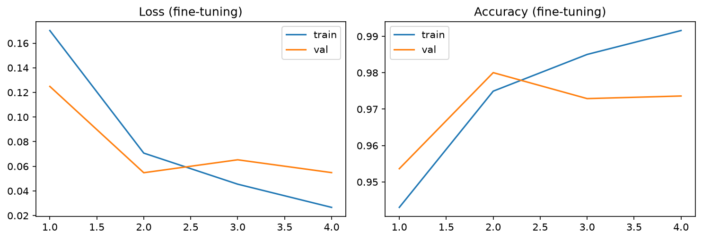
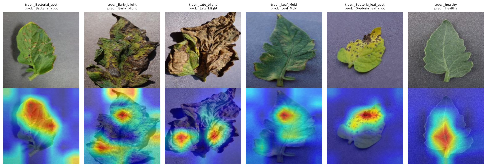

# Tomato Leaf Disease Classifier (Transfer Learning)

Image classification of tomato leaf diseases with a pretrained MobileNetV3, trained on a CPU, with per-class evaluation, Grad-CAM checks, and a Streamlit demo.

**Stack:** Python, PyTorch, torchvision, scikit-learn, Grad-CAM, Streamlit



## Problem
Classify a tomato leaf photo into one of 6 classes: healthy, or one of five diseases (bacterial spot, early blight, late blight, leaf mold, Septoria leaf spot). Computer vision, multi-class classification.

## Data
Subset of the PlantVillage dataset (color images, 256×256): **9,350 images, 6 classes**, from 163 MB of the original repository. Class sizes range from 952 (Leaf Mold) to 2,127 (Bacterial spot).
Stratified split with a fixed seed: 6,545 train / 1,402 validation / 1,403 test (`splits.csv`).

## Method
- **Backbone:** MobileNetV3-Large pretrained on ImageNet (torchvision), new 6-class head.
- **Preprocessing:** 224×224, ImageNet normalization.
- **Augmentation (train only):** random resized crop, horizontal and vertical flips, rotation up to 20°, mild brightness/contrast jitter. No hue or saturation changes, since color is a diagnostic signal.
- **Stage 1, head only:** frozen backbone, Adam lr 1e-3, 5 epochs.
- **Stage 2, fine-tuning:** last backbone blocks unfrozen (3.4M trainable parameters), Adam with lr 1e-4 (backbone) and 3e-4 (head), cosine schedule, 4 epochs.
- Checkpoints chosen by validation macro-F1. The test set was evaluated once, at the end.
- Everything was trained on a laptop CPU (about 4 to 9 minutes per epoch).

## Results
| Model | Val accuracy | Val macro-F1 |
|---|---|---|
| Head only | 0.948 | 0.943 |
| Fine-tuned | 0.980 | 0.979 |

**Test set (n = 1,403), fine-tuned model:** accuracy **0.979** (95% CI about ±0.007), macro-F1 **0.977**.

| Class | Precision | Recall | F1 | Support |
|---|---|---|---|---|
| Bacterial spot | 0.997 | 0.984 | 0.991 | 319 |
| Early blight | 0.942 | 0.967 | 0.954 | 150 |
| Late blight | 0.969 | 0.979 | 0.974 | 287 |
| Leaf mold | 0.986 | 0.965 | 0.975 | 143 |
| Septoria leaf spot | 0.978 | 0.981 | 0.979 | 266 |
| Healthy | 0.992 | 0.987 | 0.989 | 238 |




Fine-tuning cut validation errors from 73 to 28 images. The weakest class in the head-only model was Early blight (F1 0.853), which rose to 0.961 on validation after fine-tuning. In the head-only model, late blight was also sometimes predicted as healthy (4 validation images); this fell to at most 1 after fine-tuning.

## Explainability
Grad-CAM heatmaps on correctly classified test images show the model focusing on the leaf, not the background. I did not analyze the misclassified examples in depth.



## Limitations
- PlantVillage photos are taken in lab conditions (single leaf, plain background). Accuracy on photos taken in the field is expected to be much lower; this project does not measure it.
- The same leaf can appear in several photos, so near-duplicates may exist across train and test and the test score may be optimistic.
- Only 6 tomato classes; no out-of-distribution detection, so any input gets one of the 6 labels.
- The checkpoint was selected on the validation set, and there was no hyperparameter search or multiple seeds.
- Short CPU training (9 epochs in total).

## Run it
```bash
pip install -r requirements.txt
streamlit run app.py
```
`samples/` contains one test image per class for trying the demo.

To retrain, download the 6 tomato classes (about 163 MB) with a sparse Git checkout:
```bash
cd data
git clone --filter=blob:none --no-checkout --depth 1 https://github.com/spMohanty/PlantVillage-Dataset PlantVillage-repo
cd PlantVillage-repo
git sparse-checkout init --cone
git sparse-checkout set raw/color/Tomato___Early_blight raw/color/Tomato___Late_blight raw/color/Tomato___Leaf_Mold raw/color/Tomato___Septoria_leaf_spot raw/color/Tomato___Bacterial_spot raw/color/Tomato___healthy
git checkout
```
then run `notebooks/01_data.ipynb` and `notebooks/02_training.ipynb` in order.

## Credits
PlantVillage dataset: Hughes & Salathé (2015); Mohanty et al. (2016). Licensed CC BY-SA.